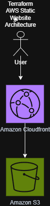

# terraform-aws-static-website
Deploying a static website on AWS using Terraform
# Terraform AWS Static Website

## Project Overview

This project deploys a static website on AWS using Terraform.

## Services Used

- Amazon S3
- Amazon CloudFront
- Terraform
## Architecture Diagram

## Project Status

In Progress 🚀
